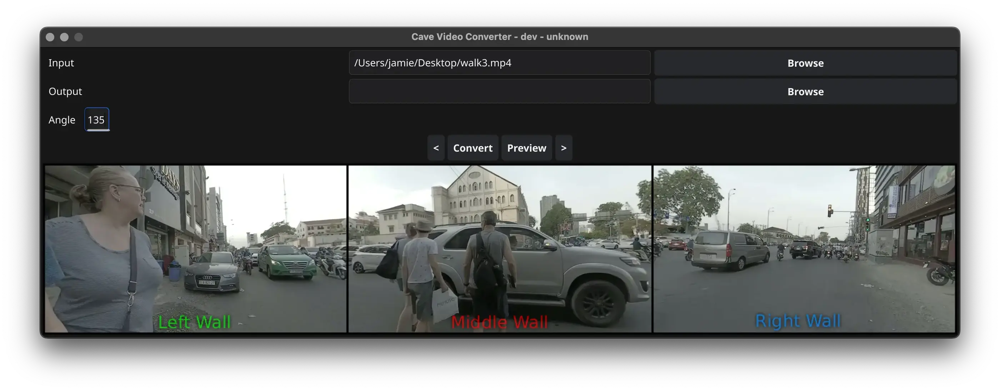

# 360 Video Converter for the MMU CAVE Facility

This program was created as part of my software development internship at Manchester Metropolitan University.
Written as an "internal tool" of sorts, it takes panorama 360 videos one may download from YouTube or other sources, and converts it into a format that can be used as background videos in [Intuiface](https://www.intuiface.com/presentation-software-for-education) for use in the university's [CAVE facility](https://www.mmu.ac.uk/about-us/faculties/health-and-education/research/education-pedagogy-and-practice/simulation-based-education).

## How to Use
If you just want to go ahead and use the program, head over to the [releases tab or click here](https://github.com/skiletro/cave-360-video-converter/releases/) to download a copy for your operating system.
Ensure that you have `ffmpeg` installed in your systems $PATH.

On Windows, you can install it using [this winget command](https://winstall.app/apps/Gyan.FFmpeg) in your terminal.
Alternatively, if the program detects you are on Windows, it will try and do this for you.

On Linux/macOS, install FFmpeg using your package manager of choice. [Here is the Homebrew formula.](https://formulae.brew.sh/formula/ffmpeg#default)

## Compiling and Contributing
The recommended way to compile this program on Linux/macOS is by using the Nix flake, and just running `nix build .#` or `nix build .#windows`.

On Windows, please follow the prerequisites [here](https://docs.fyne.io/started/).
Internally, the program uses the Fyne toolkit, and requires Go 1.25.0 and MSYS2 MinGW.
You can find more information about this over on the prerequisites page linked prior.

If you can't use the Nix flake for whatever reason, you can also follow the prerequisites page for your operating system of choice.
I have tested the program on Windows, Linux (NixOS), and macOS (Nix build system and manually). Mobile operating systems are unsupported.
